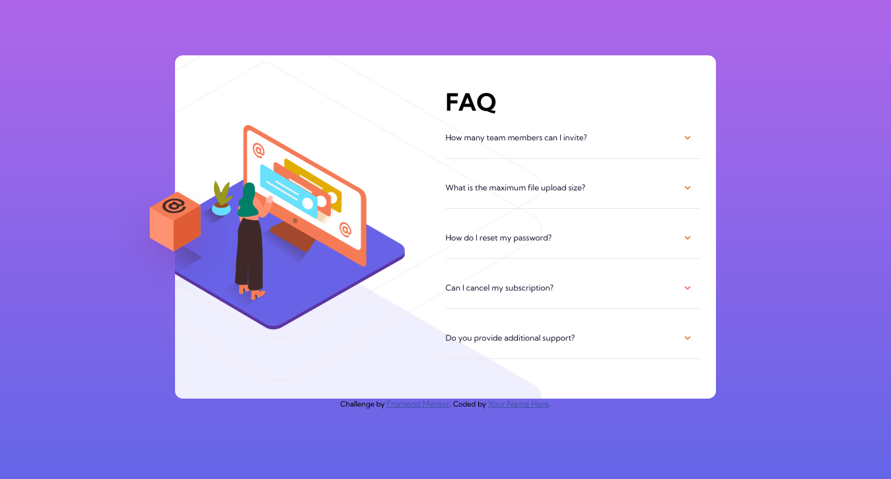

# Frontend Mentor - FAQ accordion card solution

This is a solution to the [FAQ accordion card challenge on Frontend Mentor](https://www.frontendmentor.io/challenges/faq-accordion-card-XlyjD0Oam). Frontend Mentor challenges help you improve your coding skills by building realistic projects.

## Table of contents

- [Overview](#overview)
  - [The challenge](#the-challenge)
  - [Screenshot](#screenshot)
  - [Links](#links)
- [My process](#my-process)
  - [Built with](#built-with)
  - [What I learned](#what-i-learned)
  - [Continued development](#continued-development)
  - [Useful resources](#useful-resources)
- [Author](#author)

## Overview

### The challenge

Users should be able to:

- View the optimal layout for the component depending on their device's screen size
- See hover states for all interactive elements on the page
- Hide/Show the answer to a question when the question is clicked

### Screenshot



### Links

- Solution URL: (https://github.com/branalex94/faq-accordion-card)
- Live Site URL: (https://branalex94.github.io/faq-accordion-card/)

## My process

### Built with

- Semantic HTML5 markup
- CSS custom properties
- Flexbox
- Mobile-first workflow

### What I learned

I learned how to scale images to fit different screens and to implement a few animations on images.

```css
.wrapper {
  flex-direction: row;
  width: 60vw;
  padding-bottom: 0;
  background-image: url(./images/illustration-woman-online-desktop.svg),
    url(./images/bg-pattern-desktop.svg);
  background-repeat: no-repeat, no-repeat;
  background-position: -15% center, -22rem 19%;
  background-size: 50% auto, 100% auto;
}
```

```js
const toggleQuestion = (e) => {
  const faqContainer = e.currentTarget.children[0];
  const faqTitle = e.currentTarget.children[1];

  faqContainer.style.getPropertyValue("--arrow-direction") === "180deg"
    ? faqContainer.style.setProperty("--arrow-direction", "0")
    : faqContainer.style.setProperty("--arrow-direction", "180deg");
  faqContainer.classList.toggle("faq__question__container__header--active");
  faqTitle.classList.toggle("faq__question__container__text--active");
};
```

### Continued development

I'll be able to use the knowledge I obtained in this project to make better use of the images and DOM manipulation.

### Useful resources

- (https://www.w3schools.com/howto/howto_js_accordion.asp) - This helped me better understand the functionality of an accordion animation using CSS.

- (https://developer.mozilla.org/en-US/docs/Web/CSS/gradient/linear-gradient()) - This helped me remember how to properly use the linear gradient value for background property.

- (https://drafts.csswg.org/css-transforms/#funcdef-transform-rotate) - This helped me get an idea on how to interact with CSS pseudo-elements to toggle my arrow icon.

## Author

- Frontend Mentor - [@branalex94](https://www.frontendmentor.io/profile/branalex94)
- Twitter - [@yourusername](https://github.com/branalex94/)
